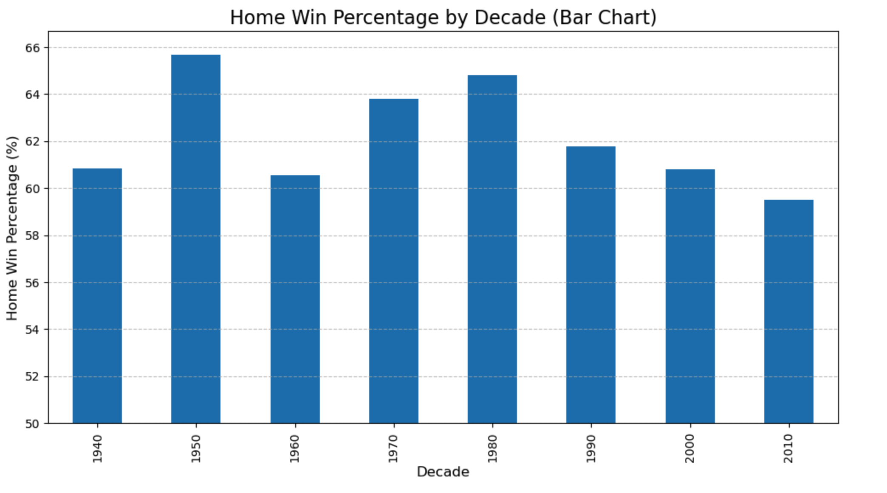
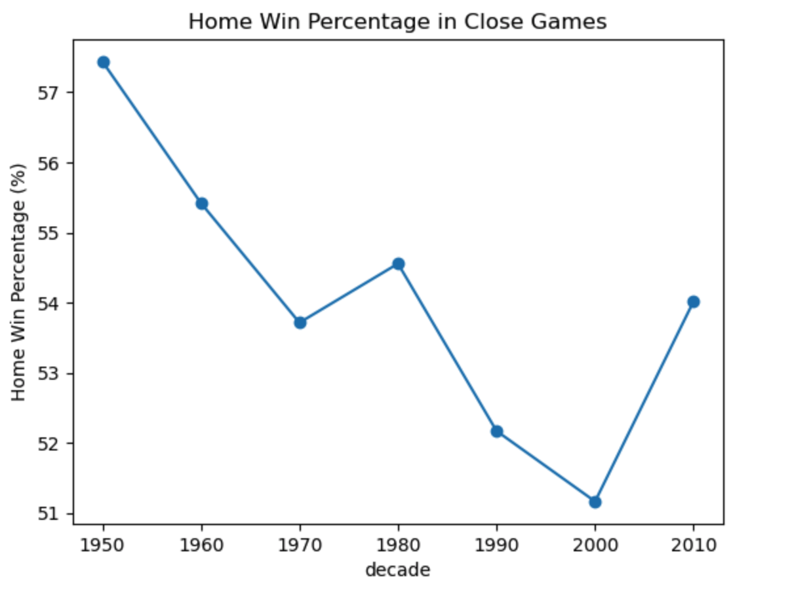
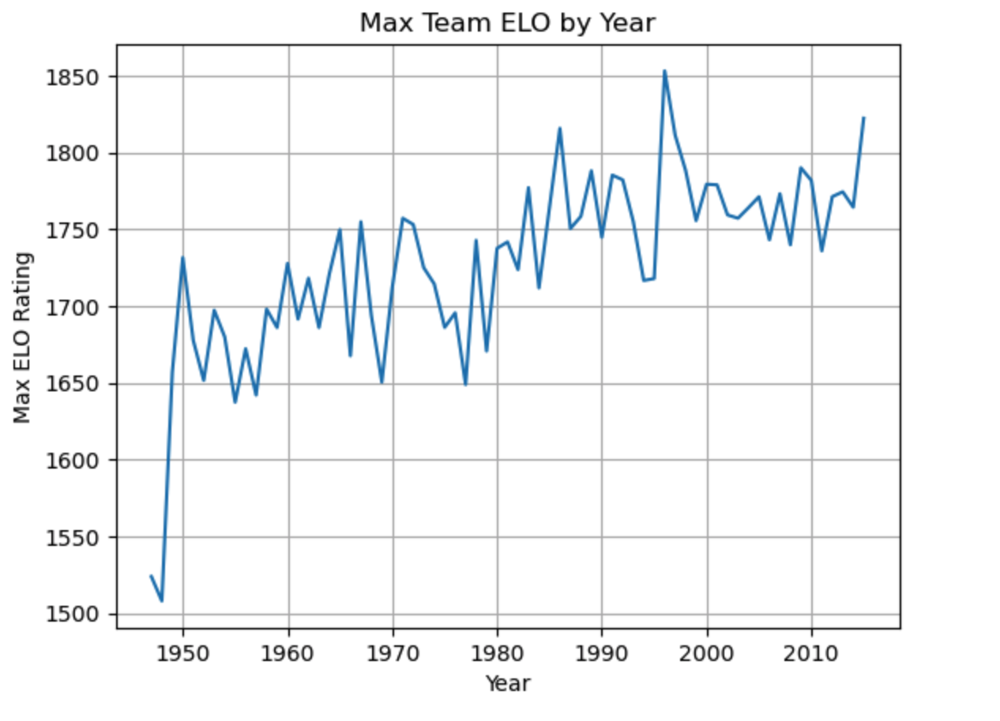

# Analying the Decline of NBA Home Court Advantage
# Does NBA Home Court Advantage matter anymore?
## Intro
In any sport, being a home team can create a huge advantage. For example, throwing a pinpoint accurate pass in college in seeminly harder when a couple thousand college students are screaming at you. For a while, The NBA home court advantage is one of the more underrated, yet most powerful factors in sports. For decades, the energy level of the home crowd, combined with the slugglishness from the high volume of games, created one of the most polarizing factors in a game.
However, taking a look into the data would reveal that this once thought major advantage is not being used the same, as the rate of wins at home, especially in close games, is declining. With NBA talent peaking at an all time high, you would think this would not be the case. This look at game data from the 1940s to the 2010s shows that as the league became more even and more talented, the advantage of playing at home has slowly faded due to team greatness. 
### The Overall Decline of Home Court Advantage
This chart shows the average home win percentage for each decade from the 1940s through the 2010s. It helps us see how the advantage of playing at home has changed over time. From the chart, it. is easy to see that playing at home if beneficial, as you win at over a 50% clip at home alll time says the stats. However, the trend is declining, as home court advantage, out of context, is seeming to dip in it's importance. This is shown in the 2010's as it is the first decade in NBA history to ever have a home win percentage of less then 60%

This graph is important because it shows the long-term decline of NBA home-court advantage, dropping from a peak of 64% in the 1970s to 54% in the 2020s, challenging the idea of an  home edge. Now, traveling teams are more prepared then they were in the 1900s, with NBA having access to much better technolocgy, recovery, planes, and many other factors that make playing on the road easier. With games being harder to win now, especially in the Western Conference with as many as 7-8 elite teams, teams should prioritize getting more fans into the stadium and not pricing out loyal fans of the franchise. 
### The Decline of Home Court Advantage affecting close games
Since 1940, teams are struggling to close out home games, only winning around 50%, with a near steady decline since the beginning of the NBA. This trend shows that being at home and having the crowd on your side is not nearly as important as we may have thought, as the stead pace shows that not there is not a smuch advantage to being home as there is to being away. However, the graph still does show a slight dip, going from 57% to 51%, which can be a decrease from around 25 Wins at home in the clutch to around 20.5. Although that seems insignifgant, the margin to make the playoffs has only become more narrow, showing the importance of winning every game. 

This graph is important because it shows the steadiness of the decline to winning at home. To a casual eye, it would seem that Home Court Advantage is a constant factor that allows teams to have an edge. And altough that may be true, Home Court Advantage is predicted to take an even more drastic swing down because of how good NBA teams are getting
### The Part you DON'T see: Basketball is peaking.
When a historically great team (for example the 1996 Bulls) plays a mediocre or even good team, the talent gap is so large that the home court’s small boost—crowd noise, familiar rims, travel fatigue—simply doesn’t matter. A superteam’s skill, system, and execution are too much for an inferior opponent, regardless of who is at home. In my notebook, I pinpointed the 96 Bulls to win at nearly an 87% chance on the road, regardless of who they played. This is because the Bulls were so dominant on the road AND at home that the venue didn't matter to them as much.

This graph is very important, as there is a constant trend of teams getting better, as there elo in this data set is increasing, only peaking in 1996 due to Jordans Bulls. This means that in matchups where talent difference is extreme, the “home” team (the weaker one) loses the supposed Hone Court Advantage benefit completely because they’re outclassed. As the “best team” in the NBA gets stronger, that team steals wins on the road that historically and statistically should have gone to the home team. This drags down the league-wide home win percentage, creating that downward trend in the first chart. 
# Therefore, what does this show?
Through the 3 Charts and 96 Bulls calulation, we can see how the NBA's home-court advantage is systematically fading away because elite talent has become the ultimate equalizer. The primary evidence, the overall declining home win percentage, is directly supported by the fact that the home team is failing to convert in close games, showing the advantage is not as prominent when it is needed most. This trend is not due to a stable parity, as the third chart reveals an ongoing volatility in the peak dominance of the league's best teams. Therefore, these changes and trends lead to one major conclusion: superior skill negates venue advantage. A historical case in point is the 1996 Chicago Bulls, which when calculated found out they won 86% of there road games, far more then the 50% by most teams.Even though this data set runs out, the Thunder are on a historic pace to win more then 95% of there road games, completely negating the home court advantage for the other team due to there sheer dominance. Going forward, teams should learn back into packing the stands and creating an atmosphere that feels like they are playing at home in the hopes to bring back Home Court Advantage in the NBA

